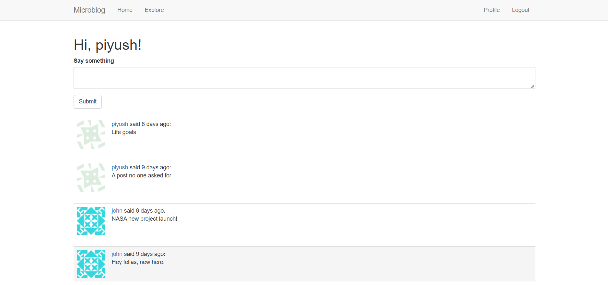
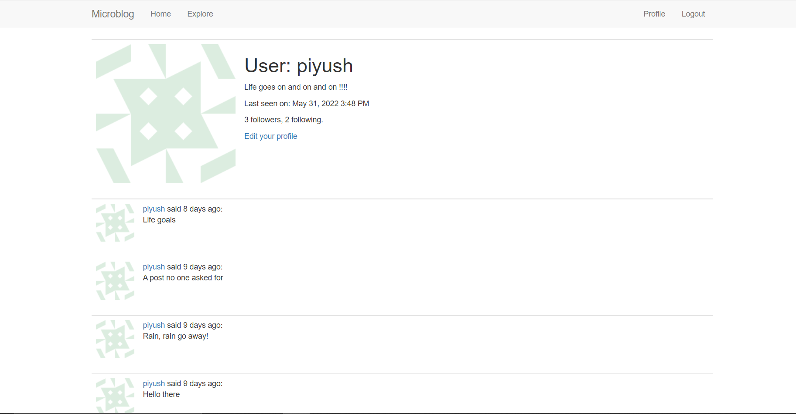

# Flask microblog

A microblog web application which allows users to make accounts, login, write bio, make posts, and follow other users.

#

### App Demo

https://flask-microblog-piyush.herokuapp.com/

#

### Built With

- Python
- Flask

#

### Running locally

--> Clone this repository

```bash
$ git clone https://github.com/py-PiYush/Flask-microblog.git
```

--> Install the requirements

```bash
$ pip install -r reqirements.txt
```

-->Run following commands

```bash
$ export FLASK_APP=microblog.py
$ flask db update
$ flask run
```

The app will be available to view in browser at [localhost:5000/](localhost:5000/)

#

### App Preview

<table width="100%"> 
<tr>
<td width="50%">      
&nbsp; 
<br>
<p align="center">
  Feed Home
</p>

</td>

<td width="50%">
<br>
<p align="center">
  User Profile
</p>
  
</td>
</table>

#

### Tutorial

This web app is built by following [Miguel Grinberg's](https://github.com/miguelgrinberg) awesome tutorial: [The Flask Mega-Tutorial](https://blog.miguelgrinberg.com/post/the-flask-mega-tutorial-part-i-hello-world)
